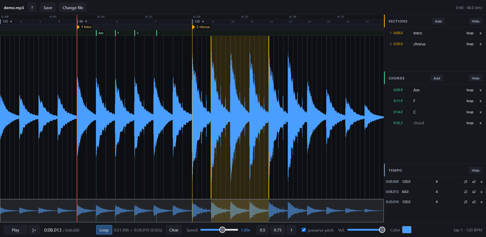

# aures

Transcribe songs by ear. One self-contained HTML file: no server, no build step, no dependencies.

**[Open it](https://memoriainfinita.github.io/aures/)** and drop an audio file on the page.

No audio at hand? [`demo.mp3`](demo.mp3) is a 40-second synthetic track with four clearly different sections, made for trying the app out.

Your audio never leaves your machine. The file is read locally by the browser and nothing is uploaded anywhere.

*aures* is Latin for the ears — and, in classical usage, for the judgement of a listener whose ear is trained.

## What it does

- **Waveform** with wheel zoom, shift+wheel pan, and an overview strip showing where you are in the song
- **Loop** any region by dragging over the waveform; drag the edges to adjust, or nudge them in 20 ms steps from the keyboard
- **Section markers** and **chord markers** in separate lanes, each named, draggable, and saved
- **Bar grid** from a tempo you tap in with `T`: drag its anchor to line the grid up with a song whose intro does not start on beat one, and drop further anchors wherever the song changes tempo or metre. It is a guide to read against, never a magnet: your markers stay where you put them
- **Hide any lane** with `shift+M`, `shift+C` or `shift+T`, or from the side panel. A hidden lane gives its height back to the waveform, so you can put the chords away and look at the shape of a passage on its own
- **Undo and redo** for markers and tempo anchors, so a mistaken delete costs one `Ctrl+Z` rather than an evening
- **Speed** from 0.25x to 1.5x with pitch preserved, so a passage slowed down stays in tune
- **Per-file memory**: reopen the same audio and its markers, loop and speed come back automatically

Double-click any marker to loop from there to the next one — the fastest way to drill a single chord change or a bar you keep missing.

## Keyboard

| Key | Action |
| --- | --- |
| `K` / space | play / pause |
| `J` / `L` | seek back / forward (5s; shift 1s, alt 0.1s) |
| `up` / `down` | zoom in / out, `0` fit whole song |
| `M` | add section marker |
| `C` | add chord marker |
| `T` | tap the beat to set the tempo |
| `shift+M` / `shift+C` / `shift+T` | hide or show the sections, chords or tempo lane |
| `Ctrl+Z` / `Ctrl+Shift+Z` | undo / redo |
| `I` / `O` | set loop in / out |
| `R` | loop on / off |
| `,` `.` / `<` `>` | nudge loop start / end |
| `1`..`9` | jump to section n |
| `+` / `-` | speed |
| `S` | save the markers to a file |
| `F` | follow the playhead on / off |
| `Home` | back to start, or to the loop start when a loop is on |
| `?` or `H` | all shortcuts, including mouse |

## Moving work between machines

`localStorage` is per browser and per machine. Press `S`, or the **Save** button, to
download a small `.aures.json` you can keep next to your audio. Drop that file on the
page on another machine and the markers come back.

It only loads back onto the same audio. The file records the size and duration of the
track it came from and refuses to import onto anything else: the times would be
meaningless against a different cut of the song. Renaming the audio file is fine, the
name is not part of the check.

## Running it locally

Download `index.html` and open it in a browser. That is the whole installation.

## Browser support

Chrome and Firefox. Pitch-preserved playback relies on the media element's `preservesPitch` property; below roughly 0.5x the browser's time-stretching starts to sound metallic. Markers and settings are stored in `localStorage`, so they are per-browser and per-machine.

## License

GNU General Public License v3.0 or later. See [LICENSE](LICENSE).
